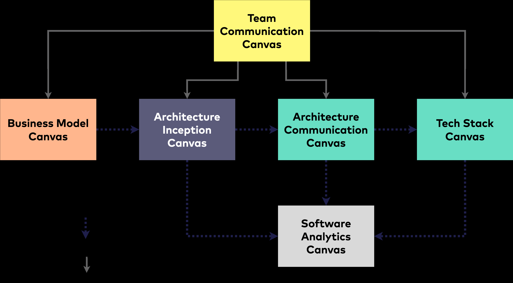

[#einfuehrung]
== Einführung

[quote, Aristoteles]
____
Das Ganze ist mehr als die Summe seiner Teile.
____

Mit Canvas bezeichnen wir die strukturierte Visualisierung von Sachverhalten - und nicht die Zeichenfläche der Malerei (oder der grafischen Programmierung etwa mit Java-Swing oder HTML5). Damit erreichen wir die kürzestmögliche Dokumentation, vom zugrunde liegenden Geschäftsmodell über konkrete Anforderungen, die Lösungsarchitektur, betriebliche Aspekte bis hin zur Zusammenarbeit im Team.

Wir zeigen Ihnen Struktur und Inhalte verschiedener Canvasesfootnote:[Als Mehrzahl verwenden wir Canvases, weil es der klassischen Pluralform der englischen Sprache entspricht.], die wir in der Realität anspruchsvoller IT-Projekte zu schätzen gelernt haben (und immer wieder gerne verwenden). Einige davon haben wir selbst entwickelt und durch Feedback aus der Praxis verfeinert.

* *Business Model Canvas:* Sicherlich *_der_* Canvas schlechthin: Der klassische Steckbrief für Geschäfts- oder Business-Modelle.
* *Architecture Inception Canvas:* Der solide Start in IT-Vorhaben, von einem Überblick der Anforderungen zu ersten Lösungsideen.
* *Architecture Communication Canvas:* Architekturdokumentation in Kurzform, passend zu arc42.
* *Software-Analytics Canvas:* Grundlage systematischer Verbesserung.
* *Tech-Stack Canvas:* Die technischen Grundlagen Ihres Systems.
* *Team Communication Canvas:* Wie wollen wir zusammenarbeiten?

All diese Steckbriefe hängen inhaltlich eng zusammen:

.Inhaltlicher Zusammenhang der Canvases

[#empfehlungen]
=== Empfehlungen

* *Erstellen Sie Ihren Canvas im Team* oder zumindest einer (kleinen) Gruppe. Dadurch erhalten Sie einen breiteren Blick auf die Situation und werden mehr interessante Aspekte berücksichtigen. Die Akzeptanz steigt beträchtlich, und außerdem macht es mehr Spaß (was beim Thema Dokumentation ein gewichtiges Argument darstellt).

* *Erst die Inhalte, dann die Werkzeuge*: Statt lange über das passende Werkzeug zu diskutieren, sollten Sie sich um die Inhalte Ihres Canvas kümmern. Wir haben ein Kapitel zu Werkzeugen aufgenommen, ab Seite 65, und stellen einige unserer Favoriten vor.

* *Holen Sie Feedback zum Canvas ein*, am besten von unterschiedlichen Stakeholdern. Dadurch validieren Sie Hypothesen und können den Inhalt schnell verbessern.

* Arbeiten Sie *pragmatisch* mit den Canvases: Lassen Sie ruhig eine Sektion frei, oder kennzeichnen Sie sie mit _noch unklar_ oder _under discussion_. (Beispiel: Im Architecture Communication Canvas nennen manche User die Sektion „Risiken" in „Technische Schulden" um, weil ihnen diese Information wichtiger scheint.)
