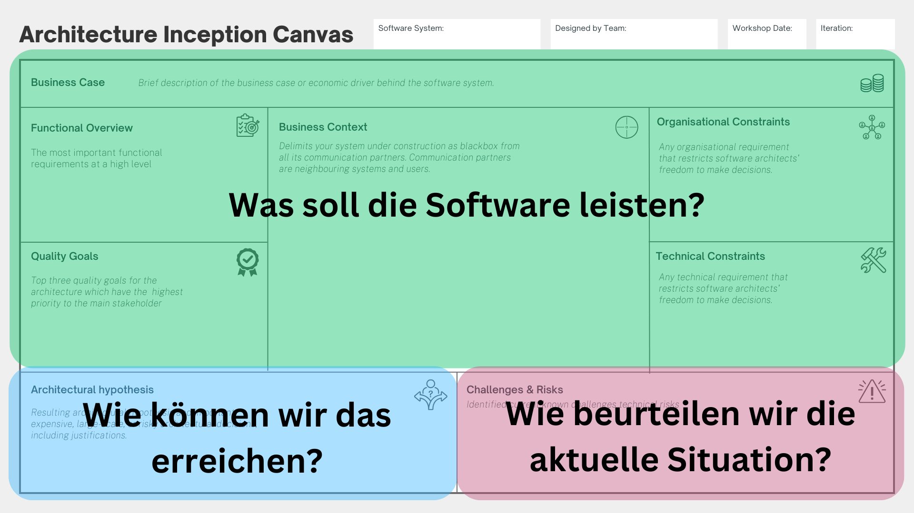
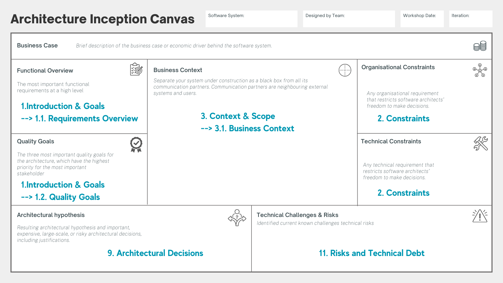
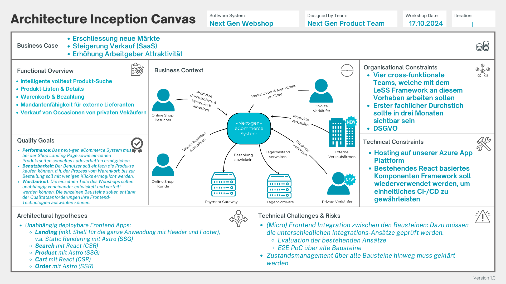

[#architecture-inception-canvas]
=== Architecture Inception Canvas

Von Patrick Roos.

_Der kollaborative Kickstart für Ihre Softwarearchitektur._

.Architecture Inception Canvas
image::img/canvas-007.png[Architecture Inception Canvas]

[#aic-motivation]
==== Motivation

Das Szenario, welches wahrscheinlich jede:r Entwickler:in liebt: Der Start einer neuen Softwareinitiative und die damit verbundenen technischen Fragestellungen:

* Sollen wir einen Microservices-Ansatz verfolgen?
* Funktional oder objektorientiert?
* Folgen wir dem hexagonalen Architekturansatz?
* Machen wir ein Event-driven Design mit CQRS?
* Oder probieren wir mal einen Serverless-Ansatz?
* Java, F#, Go oder Rust?
* Azure, AWS oder GCP?
* NoSQL vs. SQL? MongoDB vs. PostgreSQL?
* Angular vs. React vs. Solid?
* Docker vs. Podman?
* Continuous Integration und Deployment Pipelines? GitOps?

Das sind ganz viele spannende technische Fragestellungen für Technologie-Enthusiasten wie uns.

Aber Moment – sind diese Fragen überhaupt relevant am Anfang einer Softwareinitiative?

Entwicklungsteams geraten zu Beginn einer Softwareinitiative leider oft in die gleiche typische Falle: der starke Drang, sich ausführlich mit den faszinierenden, technologisch getriebenen Detailfragen auseinanderzusetzen.

Natürlich diskutieren wir gerne über Technologien und trendige architektonische Ansätze. Aber diese Diskussionen sind zu Beginn einer neuen Softwareinitiative nutzlos, weil man zuerst sein „Architektur- und Technologiespielfeld" definieren muss.

Wenn man als Team sein „Spielfeld" nicht kennt, hat man keine Grundlage, um technische Entscheidungen zu fällen und entsprechend zu begründen.

Aus der Erfahrung zeigt sich, dass Produktteams stets dieselben grundlegenden Fragen klären müssen, bevor die Diskussion technischer Themen sinnvoll ist.

Deshalb hat Patrick Roos siehe <<roos>> den Architecture Inception Canvas (AIC) entwickelt, der Produktteams dabei hilft, die Grundlage für Softwarearchitekturarbeit effizient und kollaborativ zu erarbeiten.

[#aic-zielgruppe]
==== Zielgruppe

Der Architecture Inception Canvas (AIC) lädt das ganze Produkt- oder Projektteam dazu ein, gemeinsam die Grundlage für die Softwarearchitektur kollaborativ zu erarbeiten.

Der AIC ist für alle geeignet, die an Softwarearchitektur arbeiten, beispielsweise:

* Product Owner:innen
* Projektmanager:innen
* Business Analyst:innen
* UX Designer:innen
* Softwareentwickler:innen
* Softwarearchitekt:innen
* Tester:innen
* ...

[#aic-inhalte]
==== Inhalte

Der Architecture Inception Canvas besteht aus den folgenden drei Hauptbereichen:

* *Ziel:* Was soll die Software leisten?
* *Lösung:* Wie können wir das erreichen?
* *Bewertung:* Wie beurteilen wir die aktuelle Situation hinsichtlich Herausforderungen und Risiken?

.Die drei Hauptbereiche des AIC

[#aic-business-case]
===== Business Case - das Warum und Wozu

Wenn man als Unternehmen Geld verdienen muss, gibt es hinter jeder Softwareinitiative einen wirtschaftlichen Treiber bzw. einen Business Case. Wenn nicht, handelt es sich um ein Hobby- oder NPO-Projekt.

Ein häufiger Fehler ist es, dass das Entwicklungsteam – oder schlimmer noch, das gesamte Produktteam – sich des spezifischen wirtschaftlichen Treibers oder des Business Cases hinter der Softwareinitiative nicht bewusst ist.

Wenn Sie den wirtschaftlichen Treiber oder den Business Case hinter der Softwareinitiative nicht kennen oder erklären können, sollten Sie nicht weitermachen. Sie sind als Produktteam so nicht in der Lage, einen sinnvollen Rahmen für Ihre Softwarearchitektur zu definieren, weil Sie nicht genau wissen, welche High-Level-Treiber Ihre Softwarearchitektur maßgeblich bestimmen.

Deshalb ist es essenziell, dass jedes Teammitglied den wirtschaftlichen Treiber kennt und den Business Case hinter der Softwareinitiative erklären kann.

Mit dem Abschnitt „Business Case" des Architecture Inception Canvas setzen Sie jedem Teammitglied den unternehmerischen Hut auf und befähigen so Ihr Team bzw. jedes einzelne Teammitglied, unternehmerisch zu denken.

Oft stärkt dieses Mitdenken die intrinsische Motivation des Teams und unterstützt Sie sowohl bei den täglichen Mikro- als auch Makro-Entscheidungen während der Umsetzung des Softwareprodukts.

[#aic-functional-overview]
===== Functional Overview - Was auf der Produktbox Ihrer Software stehen sollte

Während Sie als Produktteam den funktionalen Überblick Ihrer Softwareinitiative erarbeiten, hilft die Vorstellung, Sie gestalten eine Produktbox Ihrer Software (sicher kennen Sie die Produktboxen noch von früher?).

Was würde auf der Produktbox Ihrer Software Initiative stehen?

An die Produktbox zu denken, hilft Ihnen, an mögliche Antworten der folgenden Fragestellungen zu kommen:

* Welchen Geschäftswert liefert Ihre Software?
* Welche Vorteile und Mehrwerte bringt sie Ihrem Unternehmen oder Ihren Kunden?
* Was sind die übergeordneten Geschäfts- oder Hauptfunktionen der Software?
* Welche zentralen Fähigkeiten und Funktionen bietet die Software an?

Mit den resultierenden Antworten auf diese Fragen können Sie die Schlüsselanforderungen Ihrer Software beschreiben.

Diese Beschreibung hilft Ihnen, den Fokus auf die wichtigsten funktionalen Anforderungen zu legen und das Gesamtbild Ihrer Software besser zu verstehen.

[#aic-quality-goals]
===== Quality Goals - die zentralen Treiber der Softwarearchitektur

Hier erarbeiten Sie die drei wichtigsten Qualitätsziele der Stakeholder für das Softwaresystem.

Es ist wichtig, dass diese Qualitätsziele jedem bzw. jeder bekannt sind, da sie die Architektur maßgeblich prägen.

Hilfestellung: Der Standard ISO/IEC 25010 bietet einen Überblick über mögliche passende Qualitätsattribute, während das moderne arc42-Qualitätsmodell (Q42) Ihnen mehr als 150 Qualitätsattribute mit ausführlichen Erklärungen und Beispielen sammelt.

[#aic-business-context]
===== Business Context - den Scope entdecken

Der Business Context betrachtet Ihr System als eine Blackbox. Der Fokus liegt auf der Umgebung des Systems und darauf, wer das System benutzt und wie das System mit den externen Systemen interagiert. Mit dem Business Context können Sie die Kommunikationswege identifizieren und dadurch potenzielle Risiken aufdecken. Er dient zudem als wertvolles Werkzeug, um mit verschiedenen Stakeholdern den Umfang des Systems sowie die Kommunikationswege zu externen Systemen zu diskutieren. Beim Erarbeiten des Business Contexts sollten Sie versuchen, die Nutzer Ihres Systems sowie alle angrenzenden Systeme zu identifizieren.

In diesem Abschnitt erstellen Sie eine geschäftsorientierte Kontextansicht, um eine gemeinsame Sicht auf den geschäftlichen Umfang des Systems zu erhalten. Der Fokus liegt hier auf einem gemeinsamen Verständnis. Sie können den Business Context nutzen, um verschiedenen Stakeholdern das System mit den Aktoren und Umsystemen einfach zu kommunizieren. Der Business Context bildet die Grundlage für einen späteren technischen Kontext. Es ist der Ausgangspunkt für vertiefte Architekturdiskussionen und Identifikation von Risiken.

Bis hierhin waren alle Informationen im AIC textuell - beim Business Context können Sie gerne auch ein Diagramm zur Beschreibung verwenden.

[#aic-constraints]
===== Constraints - die Begrenzung der Entscheidungsfreiheit

Organisatorische und technische Einschränkungen bestimmen den Grad Ihrer Entscheidungsfreiheit als Produktteam.

In diesem Abschnitt erarbeiten Sie alle Rahmenbedingungen, die Ihre Freiheit als Produktteam bei der Entwicklung des Softwareprodukts einschränken.

====== Organisational Constraints

Organisatorische Einschränkungen umfassen häufig Zeit und Budget. Zusätzlich gibt es oft Vorgaben zu den Methoden und Vorgehensweisen, die verwendet werden sollen (z.B. Scrum), oder zu den Techniken, die angewandt werden dürfen bzw. sollen.

====== Technical Constraints

In größeren Unternehmen gibt es oft zahlreiche technische Einschränkungen. Häufig existiert ein übergeordnetes Architekturkomitee oder Architekturboard, das Standards, Rahmenbedingungen und Prinzipien für die Technologieauswahl setzt.

Ein Beispiel: Wenn Sie sich dazu entscheiden, ein Web-Frontend zu entwickeln, kann das Architekturkomitee festlegen, dass Angular als Frontend-Framework innerhalb des Unternehmens oder eines bestimmten Geschäftsbereichs genutzt wird, um Synergien im technischen Fachwissen zwischen den einzelnen Teams zu schaffen bzw. fördern.

[#aic-architectural-hypotheses]
===== Architectural Hypotheses - die ersten Architekturannahmen treffen

Gratuliere – Sie haben es geschafft!

Sie haben eine erste Iteration durchlaufen und so die erste Grundlage für erste Architekturentscheide ihres zukünftigen Softwareprodukts erarbeitet. Sie können nun auf dieser Basis Ihre ersten Architekturannahmen treffen.

Der Fokus liegt in diesem Abschnitt auf übergeordneten architektonischen Annahmen („Makro-Architektur Hypothesen"), die das Fundament Ihrer Softwarearchitektur bilden, nicht auf detaillierten Design-Fragen.

Idealerweise nutzen Sie diese ersten Architekturannahmen, um erste Entwürfe von Architecture Decision Records (ADR)footnote:[https://www.cognitect.com/blog/2011/11/15/documenting-architecture-decisions] zu erstellen. So können Sie die initialen Architekturentscheidungen Ihres Softwareprodukts dokumentieren und im Team finalisieren.

[#aic-technical-challenges-risks]
===== Technical Challenges & Risks

Auf Basis des geschaffenen architektonischen Spielfelds – wie Business Context und Umfang, Qualitätsziele, Constraints und erste Architekturannahmen – können Sie die kommenden Herausforderungen und die daraus resultierenden Risiken ableiten bzw. identifizieren.

So können Sie vorbereitend erste risikominimierende Maßnahmen einleiten, wie z.B. Einplanung von Pufferzeiten, Erstellung von Prototypen oder Proof-of-Concepts.

[#aic-vorgehen]
==== Vorgehen

Der Architecture Inception Canvas (AIC) ist ein kollaboratives Werkzeug, das das gesamte Produktteam dazu einlädt, gemeinsam iterativ die Grundlage für die Softwarearchitektur zu erarbeiten.

Folgendes Vorgehen hat sich bewährt:

* *Vorbereitung für einen ersten on-site Workshop*
** Laden Sie das AIC-Template als PNG oder PDF herunter und drucken Sie es groß aus oder stellen Sie die einzelnen Abschnitte des AIC analog in guter Größe zur Verfügung.
** Stellen Sie sicher, dass alle notwendigen Materialien (u. a. Klebezettel, Stifte) vorhanden sind.
*** Es empfiehlt sich, für die drei Bereiche (Ziel, Lösung, Bewertung) unterschiedliche Farben der Klebezettel zu verwenden.
** Planen Sie mindestens 60 Minuten für die erste Durchführung des AIC ein.
*** Es empfiehlt sich, die Teilnehmer:innen anzuweisen, die Abschnitte des AIC für sich als Vorbereitung auszufüllen, bevor sie die Ergebnisse mit dem Team teilen.
** Laden Sie alle relevanten Stakeholder ein, mind. Product Owner:in, die Entwickler:innen und Softwarearchitekt:innen des Teams.

* *Vorbereitung für einen ersten Remote-Workshop*
** Nutzen Sie das AIC-Template in einem digitalen Kollaborations-Tool wie z.B. Miro oder Mural
** Es empfiehlt sich, für die drei Bereiche (Ziel, Lösung, Bewertung) unterschiedliche Farben der Sticky Notes zu verwenden.
** Planen Sie mindestens 60 Minuten für die erste Durchführung des AIC ein.
*** Es empfiehlt sich, die Teilnehmer:innen anzuweisen, die Abschnitte des AIC für sich als Vorbereitung auszufüllen, bevor sie die Ergebnisse mit dem Team teilen.
*** Stellen Sie jeder Workshop-Teilnehmer:in ein dediziertes AIC-Board für die Vorbereitung zur Verfügung.
** Laden Sie alle relevanten Stakeholder ein, mind. Product Owner:in und die Entwickler:innen und Softwarearchitekt:innen des Teams und stellen Sie sicher, dass alle Zugriff auf das digitale Kollaborations-Tool haben.

* *Durchführung des Workshops*
** Beginnen Sie mit einer kurzen Einführung in den AIC und erläutern Sie kurz die einzelnen Abschnitte.
** Es empfiehlt sich folgendes Vorgehen pro Abschnitt:
*** Jedes Team-Mitglied präsentiert die Vorbereitung pro Abschnitt.
*** Die Punkte werden anschließend geclustert und diskutiert.
*** Die konsolidierten Ergebnisse bleiben anschließend auf dem AIC stehen.
** Versuchen Sie die Timebox von 60 Minuten einzuhalten. Falls es sich abzeichnet, dass Sie mehr Zeit benötigen, ist es besser, in einer weiteren Iteration die Ergebnisse zu vertiefen.

* *Nachbereitung des Workshops*
** Die Ergebnisse können anschließend sehr einfach in eine arc42-basierte Architekturdokumentation überführt werden. Der AIC ist vollständig kompatibel mit dem arc42-Template.
*** Das kann auch ein guter Zeitpunkt sein, die Architekturdokumentation (im arc42-Format) zu starten. Definieren Sie eine:n Verantwortliche:n, der die Ergebnisse in die Architekturdokumentation überführt.
** Es können zusätzliche erste Architecture Decision Records auf Basis der Architekturannahmen erstellt werden.
** Es muss überprüft werden, ob ggf. noch eine weitere Iteration für die Erarbeitung der Softwarearchitektur-Grundlagen notwendig ist.

[#aic-empfehlungen]
==== Empfehlungen

===== AIC als Kickstart für die Dokumentation Ihrer Softwarearchitektur

Der AIC eignet sich perfekt als Start für die Dokumentation Ihrer Softwarearchitektur. Der AIC ist vollständig kompatibel mit dem https://arc42.org/overview[arc42-Template]. Sie können die Ergebnisse des AIC sehr einfach in eine arc42-basierte Architekturdokumentation überführen.

Die folgende Abbildung zeigt Ihnen die Links auf die Kapitel des https://arc42.org/overview[arc42-Templates].

.Kapitel des arc42-Templates im AIC

===== Der AIC ist auch der Start für Ihr C4 Model

Sofern Sie planen, mit dem https://c4model.com/[C4-Model] zu arbeiten, ist der AIC auch der Start für Ihr C4 Model. Das C4 Model ist ein einfaches Modell, das Ihnen hilft, die Softwarearchitektur auf unterschiedlichen Abstraktionsebenen zu beschreiben. Der Business Context im AIC entspricht nämlich dem https://c4model.com/diagrams/system-context[System Context Diagram (Level 1)] des C4-Models.

===== Möglichst Technologie-agnostisch arbeiten

Versuchen Sie in einem ersten Schritt möglichst Technologie agnostisch zu arbeiten (insb. alle Ziel relevanten Abschnitte) und sich auf die Eingrenzung bzw. Erarbeitung des „Architekturspielfeldes" zu fokussieren. Versuchen Sie dies in einem ersten Schritt auch zu forcieren.

[#aic-beispiele]
==== Beispiele

Auf der offiziellen Website zum https://canvas.arc42.org/architecture-inception-canvas[AIC] finden Sie verschiedene Beispiele, wie der AIC in der Praxis aussehen könnte.

===== Modernisierung eines Webshop-Systems

Die folgende Abbildung zeigt einen Ausschnitt, wie der AIC in einer ersten Iteration zur Modernisierung eines Webshop-Systems verwendet wurde.

.Ausschnitt einer ersten Iteration mit dem AIC

