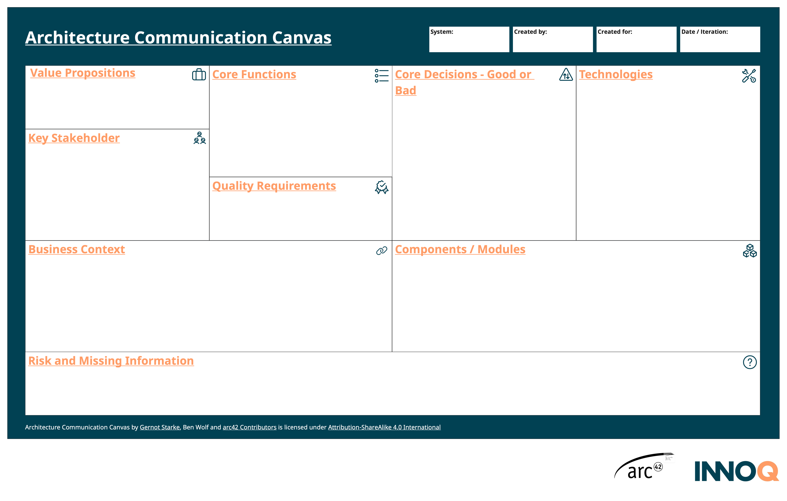
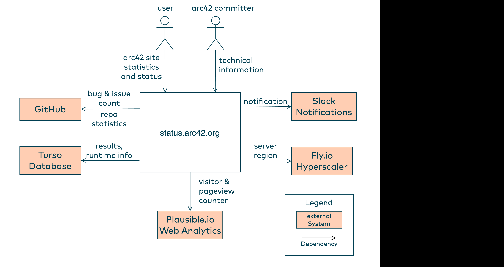
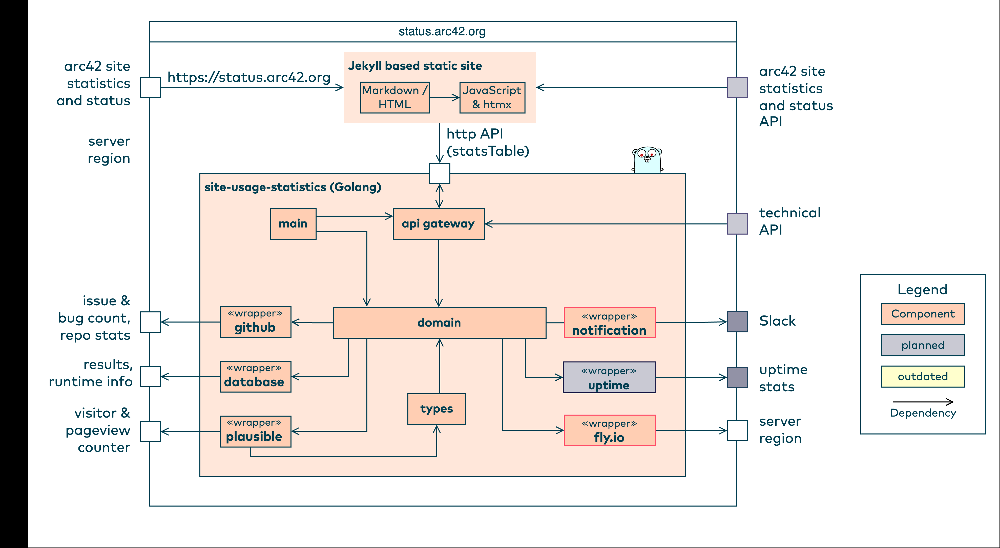
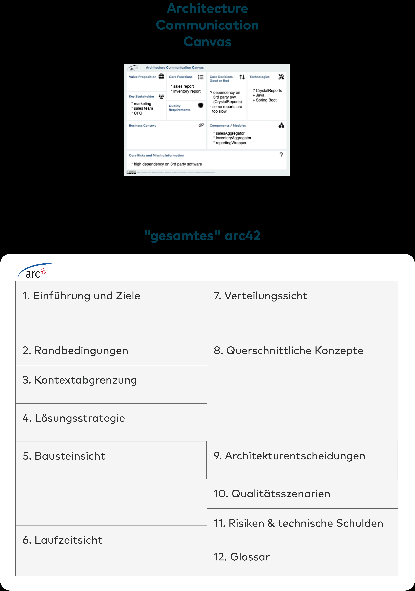
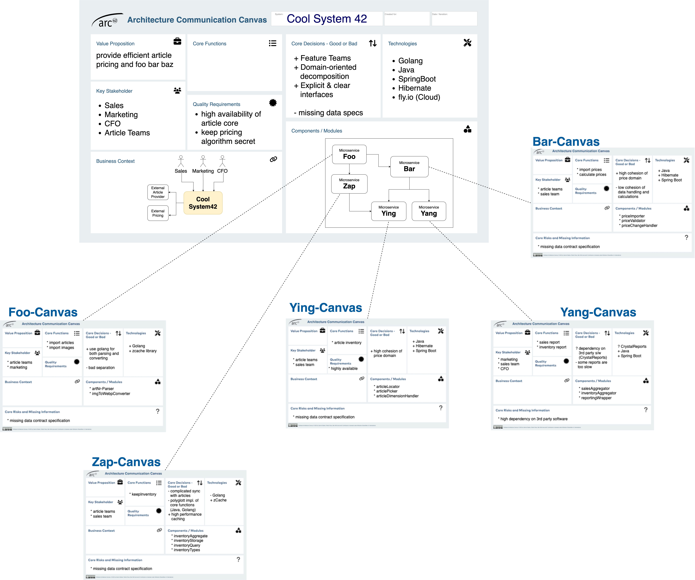
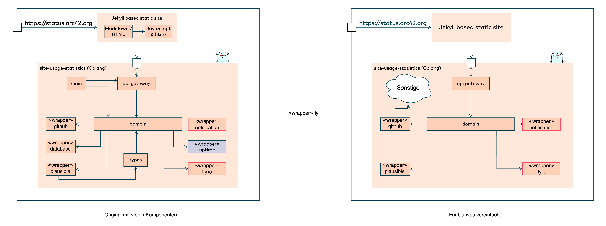
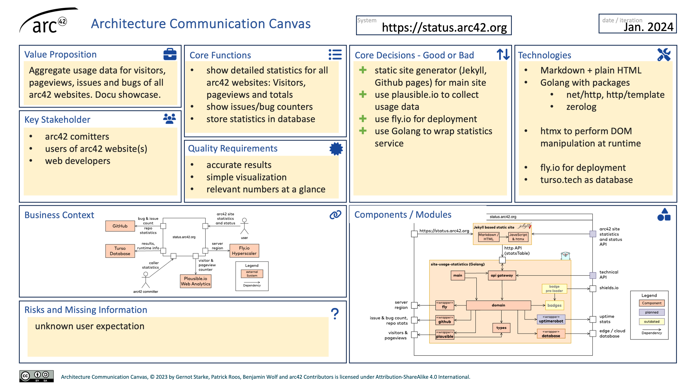

[#architecture-communication-canvas]
=== Architecture Communication Canvas

Von Benjamin Wolf und Gernot Starke.

_Architekturdokumentation in weniger als 60 Minuten._

.Architecture Communication Canvas

Der Architecture Communication Canvas (im Folgenden kurz ACC) ist die kompakteste Art der Architekturdokumentation von IT-Systemen. Glauben Sie uns nicht? Dann lassen Sie sich in diesem Kapitel davon überzeugen!

[#acc-motivation]
==== Motivation

Gernot und Ben verwenden seit Jahr(zehnt)en https://arc42.org[arc42] zur Dokumentation von Softwarearchitekturen. Wir wissen, dass wir damit die vielfältigen Interessen von Stakeholdern bezüglich Kommunikation, Dokumentation und Argumentation erfüllen können. Allerdings sind uns immer wieder Situationen begegnet, in denen eine noch einfachere und schnellere Form der Dokumentation notwendig war. Sei es, weil Zeit für Dokumentation fehlte – in unseren Augen eine Ausrede oder ein falsch gelebter Entwicklungsprozess –, oder weil niemand wusste, wie schlanke Dokumentation genau aussehen sollte.

Aus dem ACC können Sie Ergebnisse direkt in arc42 überführen. Mehr dazu finden Sie im Abschnitt Empfehlungen auf Seite 28.

Mit dem ACC bekommen Sie ein kompaktes Architekturdokument, das inkrementell mit dem Projektfortschritt wachsen kann.

Darüber hinaus soll Sie der ACC anregen, miteinander über das System zu reden. Mehr dazu im Abschnitt Anwendung des ACC auf Seite 27.

[#acc-zielgruppe]
==== Zielgruppe

Der ACC kann einige typische Fragen von Architekt:innen, Entwickler:innen, POs und Teamleiter:innen beantworten, analog zu arc42. Durch seine kompakte Form adressiert der ACC jedoch noch weitere Stakeholder, wie z. B. Personen aus dem Fachbereich oder Management, die sich einen kompakten Überblick über ein System verschaffen wollen.

[#acc-inhalte]
==== Inhalte

Analog zu arc42 reicht das Spektrum der ACC-Inhalte von Anforderungen zu Lösungs- und sogar Management-Aspekten. Dadurch ergeben sich wertvolle Beziehungen zu einigen anderen Canvases:

* Die übergreifende Zielsetzung (Value Proposition) klärt der Business Model Canvas deutlich genauer.
* Details zu Anforderungen finden Sie im Architecture Inception Canvas auf Seite 10.
* Falls Sie den ACC begleitend zu einem Review oder Audit einsetzen, beachten Sie unbedingt den Software Analytics Canvas auf Seite 43.
* Schließlich gibt der Tech-Stack Canvas ab Seite 33 einen detaillierten Überblick der eingesetzten Technologien.

[#acc-value-proposition]
===== Value Proposition

Welchen Mehrwert bietet das System? Wozu existiert es, was ist der wirtschaftliche oder fachliche Wert, den es generiert? Versuchen Sie, Ihre Antwort auf 140 Zeichen oder 2-3 Halbsätze zu beschränken.

[#acc-key-stakeholder]
===== Key Stakeholder

Welche Personen oder Organisationen üben prägenden Einfluss auf das System und die zugehörigen Prozesse aus? Welche haben ein großes Interesse am System, oder dessen Mehrwert (siehe Value Proposition) Beschränken Sie sich auf die fünf wichtigsten dieser Stakeholder.

[#acc-core-functions]
===== Core Functions

Erklären Sie in Stichworten die wesentlichen Funktionen, Aufgaben oder Prozesse des Systems. Beschreiben Sie die Kernfunktionen. Zeigen Sie insbesondere auf, welche Funktionen den Mehrwert des Systems (siehe Value Proposition) ausmachen.

Zusätzlich können Sie erwähnen, welche Funktionen/Aufgaben des Systems besondere Risiken enthalten, oder besonders schwierig zu entwickeln/betreiben sind.

[#acc-quality-attributes]
===== Quality Attributes

Neben den Kernfunktionen bilden die Qualitätseigenschaften (oder -anforderungen) ein Kernthema der Architektur. Zeigen Sie die 3-5 wichtigsten dieser Qualitätseigenschaften, am besten inklusive der geforderten Ausprägung oder Metriken.

Sie können dazu verkürzte Qualitätsszenarien verwenden – viele praktische Beispiele finden Sie unter https://quality.arc42.org

[#acc-business-context]
===== Business Context

Die Kontextabgrenzung, also die Beschreibung der wesentlichen externen Schnittstellen oder Nachbarsysteme. Bei größeren Systemen beschränken Sie sich auf die wesentlichen 3-5 externen Nachbarn. Häufig stehen diese in direktem Zusammenhang zu den Kernfunktionen (siehe Core Functions) des Systems.

Bis hierhin waren alle Informationen im ACC textuell – beim Business Context können Sie gerne auch ein Diagramm zur Beschreibung verwenden.

.Business Context des ACC

[#acc-components-modules]
===== Components / Modules

Der Grundriss des Systems, dessen Aufbau aus Komponenten, Modulen, Services oder wie auch immer Sie die einzelnen Teile Ihres Systems so nennen. Dazu kommen deren wesentlichen gegenseitigen Abhängigkeiten, also die internen Schnittstellen des Systems.

In https://arc42.org[arc42] entspricht das der (möglicherweise etwas verkürzten) Bausteinsicht Ebene 1. Verkürzt deswegen, weil Sie sich auch hier auf die wesentlichen Teile beschränken sollten. Nur einen Teil der vorhandenen Subsysteme zu erwähnen geht völlig in Ordnung, sofern Sie dann ein „Sonstiges" dazufügen.

Wie bereits beim Kontext mit den externen Schnittstellen können Sie auch hier sowohl eine Aufzählung (bullet list) verwenden als auch ein Diagramm. In den Empfehlungen zum ACC auf Seite 28 finden Sie ein paar Tipps, wie Sie Diagramme für den Canvas etwas vereinfachen können.

.ACC Components / Modules

[#acc-core-decisions]
===== Core Decisions – Good or Bad

Auf welche Entscheidungen blicken Sie mit Stolz zurück, und welche finden Sie aus heutiger Sicht fürchterlich? In großen IT-Systemen finden sich meist beide Aspekte – dieser Teil des Canvas soll genau das sichtbar machen. Beschränken Sie sich auf maximal 8-10, und bleiben Sie bei deren Formulierung auf Stichwort-Niveau. Falls Sie im Entwicklungsprozess https://www.cognitect.com/blog/2011/11/15/documenting-architecture-decisions[ADRs] verwenden, dürfen Sie natürlich gerne auf die jeweils zutreffenden ADRs verweisen.

[#acc-technologies]
===== Technologies

Zeigen Sie in Stichworten das technische Fundament Ihres Systems: Welche Technologien, Frameworks, Bibliotheken oder Produkte bilden dessen Grundlage oder besitzen besondere Bedeutung? Neben den Programmiersprachen zählen hierzu beispielsweise Frameworks für grafische Oberflächen (QT, GTK, Electron, React, JavaFX o. Ä.), Kommunikation/Integration (REST, Apache-Kafka, gRPC, TCP- or Websockets o. Ä.) oder Persistenz (PostgreSQL, SQLite, MariaDB, CouchDB o. Ä.). Solche Technologien haben oftmals prägenden Einfluss auf die Entwicklung und den Betrieb von Systemen. Eine detaillierte Darstellung bietet der Tech-Stack Canvas auf Seite 33.

[#acc-risks-missing-information]
===== Risks and Missing Information

Schon bei den Entscheidungen im Canvas (siehe oben, Decisions – Good or Bad) konnten Sie problematische Entscheidungen als solche kennzeichnen. Hier gehen Sie noch einen Schritt weiter und führen wesentliche Risiken auf, die beim System drohen. Die können sich auf alle beteiligten Stakeholder oder Prozesse beziehen, angefangen von den Anforderungen, über Entwurfs- und Architekturthemen, bis hin zu Test, Deployment, Betrieb, Support oder auch Management des Systems. Denken Sie bei der Betrachtung der Risiken in die Breite und führen Sie auch Risiken auf, die außerhalb von Code und Technologie liegen.

[#acc-anwendung]
==== Anwendung des ACC

Wir verwenden den ACC zu ganz unterschiedlichen Zwecken:

* Als Einstieg in die Nachdokumentation bestehender Systeme. In diesem Fall verschafft sich das Team durch den ACC einen Architekturüberblick und entscheidet auf dieser Grundlage, welche Teile von arc42 noch weiter ausgeführt werden sollen.
* Als Einstieg in Reviews von Systemen: Hier bekommen die Reviewer einen Überblick relevanter Entscheidungen und können die Schwerpunkte des Reviews damit besser festlegen. Beachten Sie für diesen Fall unbedingt unseren Software-Analytics Canvas auf Seite 43.
* Als Steckbrief fürs Management und Management-Gremien (z.B. die berühmten Lenkungskreis-Meetings): Markieren Sie in diesem Fall die wesentlichen Änderungen seit dem letzten dieser Meetings. Nutzen Sie dafür die Powerpoint-Version vom Canvas, dann können Sie im Meeting im Präsentationsmodus ganz einfach vorher-nachher zeigen.
* Zur Vorstellung Ihres Systems. Im Canvas dokumentieren Sie Ihr System auf einem Level, das für viele Zielgruppen verständlich ist. Sie können in größeren Runden Ihr System anhand des Canvas vorstellen, in dem Sie die einzelnen Abschnitte der Reihe nach durchgehen.

[#acc-empfehlungen]
==== Empfehlungen

===== ACC als Einstieg in umfangreichere Dokumentation

Betrachten Sie den ACC als die Zusammenfassung oder Kurzfassung der gesamten (Architektur-)Dokumentation, und verweisen Sie aus dem ACC auf die Verfeinerung oder Details der restlichen arc42-Dokumentation. Schematisch erkennen Sie das in Abbildung 2.5. Der Canvas gibt Interessierten einen ersten Überblick. Weitere Details und vertiefende Informationen liegen im gesamten arc42-Dokument.

[NOTE]
====
Wir haben gute Erfahrung damit gemacht, auf Basis einer bestehenden arc42-Dokumentation erhebliche Teile des ACC per LLM erzeugen zu lassen. Voraussetzung ist die inhaltliche Korrektheit und Aktualität der bestehenden Dokumentation.
====

.ACC als Einstieg in umfangreichere arc42 Dokumentation

===== ACC zur Dokumentation von Microservices

Aus unserer Sicht ein Gamechanger im Umgang mit der Dokumentation von Microservices: Spendieren Sie jedem (relevanten) Service einen eigenen Canvas. Zusätzlich erstellen und pflegen Sie einen übergeordneten Canvas, der neben den Abhängigkeiten und Schnittstellen der Services zueinander die wesentlichen übergreifenden Entscheidungen und Technologien aufführt. Abbildung 2.6 skizziert dieses Vorgehen beispielhaft.

.ACC für Microservices

===== Nutzen Sie Diagramme für Kontext und Komponenten

Wir mögen Diagramme, weil Sie unserer Erfahrung nach mehr Übersicht geben als eine reine Aufzählung (bullet list) von Komponenten oder auch Nachbarsystemen. Daher bevorzugen wir im Normalfall Diagramme.

Was aber, wenn ein solches Diagramm zu groß für den verfügbaren Platz auf dem Canvas ist?

In solchen Fällen schlagen wir den pragmatischen Ausweg eines „Sonstiges"-Symbols vor, was Sie in Abbildung 2.7 am Beispiel sehen können. Alle wichtigen Komponenten bekommen ihr eigenes Symbol, und die weniger wichtigen subsumieren Sie durch „Sonstiges".

."Sonstiges" als Platzhalter im Diagramm

Sie können darüber hinaus aber noch ein paar Vereinfachungen an diesen Diagrammen vornehmen:

* Eliminieren Sie detaillierte Informationen wie Stereotypen oder ausführliche Beschriftungen.
* Beschränken Sie sich auf einige wesentliche Schnittstellen, statt alle möglichen Beziehungen zwischen Komponenten zu zeigen.
* Verwenden Sie Abstraktionen statt Details. In Abbildung 2.7 sehen Sie auf der linken Seite die `jekyll static site` als Whitebox mitsamt den enthaltenen Elementen. Auf der rechten Seite gibt es diese nur noch als Blackbox, d.h. ohne Innenleben.

[#acc-beispiele]
==== Beispiele

Wir haben für Sie ein Beispiel mitgebracht. Weitere Beispiele zum ACC finden Sie auf der zugehörigen https://canvas.arc42.org/examples[Website].

===== status.arc42.org

Die kleine Anwendung bei arc42, die Besucherzähler sowie offene Bugs und Issues der arc42-Websites aggregiert.

Obwohl die Aufgaben dieses Systems fast trivial anmuten, haben wir es immerhin mit ein paar sehr unterschiedlichen externen Schnittstellen zu tun. Weiterhin besteht die Herausforderung, den (Cloud-)Betrieb des Systems möglichst kostengünstig respektive kostenfrei zu gestalten, weil das Ganze ja als Open-Source ohne Monetarisierung daherkommt.

.ACC von status.arc42.org

