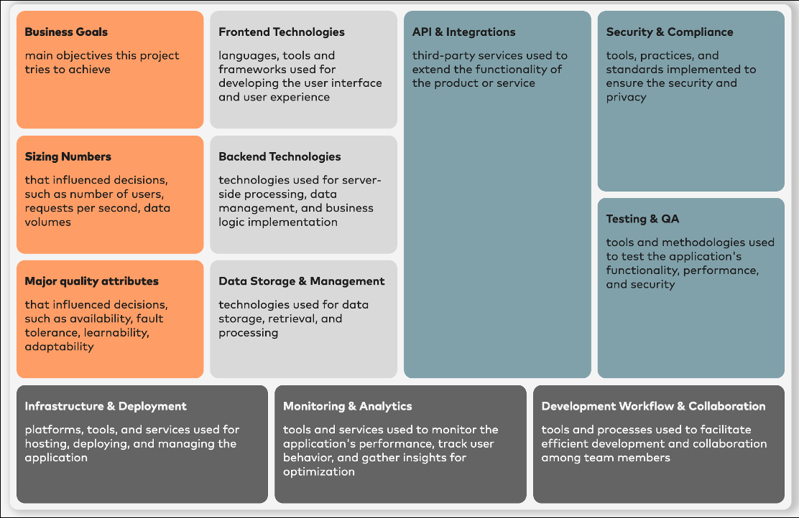

[#tech-stack-canvas]
=== Tech Stack Canvas

Von Jörg Müller.

.Tech Stack Canvas

[#tsc-motivation]
==== Motivation

In jedem Softwareprojekt gibt es Situationen, in denen das Team entscheiden muss, welche technischen Komponenten zum Einsatz kommen. Dabei stehen nicht selbst entwickelte Komponenten im Fokus, sondern bestehende Technologien und Angebote, die die Grundlage für eigene Entwicklungen bilden.

Eine typische Situation ist der Start einer neuen Kollegin oder eines Kollegen und die Frage, wo eventuell Einarbeitung stattfinden muss. Oft werden diese Informationen auch bereits bei der Erstellung der Stellenanzeige benötigt. Häufig improvisieren Verantwortliche solche Details und riskieren dadurch, wichtige Komponenten zu vergessen oder veraltete Informationen zu nutzen. Manchmal enthalten Dokumentationen oder das Wiki diese Daten, jedoch verstreut und oft nicht aktuell.

Auch beim Start eines neuen Projekts ist entscheidend, auf welchen technologischen Komponenten das Team seine Arbeit aufbaut. Eine unstrukturierte Sammlung führt schnell dazu, dass das Team wichtige Aspekte übersieht. Obwohl umfangreiche Dokumententemplates hilfreich sein können, eignen sie sich schlecht für die gemeinsame Erarbeitung im Team.

Noch komplexer wird es, wenn mehrere Teams mit unterschiedlichen Tech Stacks arbeiten. Wie sollten Sie die eingesetzten Technologien erfassen und systematisch vergleichen? Ein einheitlicher Überblick liefert wertvolle Erkenntnisse und zeigt Optimierungspotenziale auf.

Der Tech Stack Canvas wurde entwickelt, um genau diese Herausforderungen in der Softwareentwicklung zu adressieren. Er bietet eine strukturierte Methode, um die wesentlichen Aspekte eines Tech Stacks auf einer einzigen Seite zu erfassen. Damit unterstützt er das Team dabei, den Tech Stack zu konzipieren, zu dokumentieren und klar an alle Beteiligten zu kommunizieren.

[#tsc-zielgruppe]
==== Zielgruppe

Der Tech Stack Canvas ist für alle Projektbeteiligten relevant.

Für Softwareentwickler:innen bietet er einen klaren Überblick, welches Wissen zu welchen Technologien notwendig ist. Das erleichtert die Einarbeitung und den Wissensaufbau. Auch die Suche nach spezifischen Lösungen oder Frameworks gestaltet sich durch diese Übersicht einfacher.

Softwarearchitekt:innen erhalten einen Überblick über die Komponenten und können leicht erkennen, wenn mehrere Technologien dasselbe Problem lösen sollen. Auch Technologien, die nicht gut zusammenpassen, fallen schnell auf. Zudem erleichtert der Canvas den Abgleich mit projektübergreifenden Vorgaben zu Technologien. Gleichzeitig verbessert er die Kommunikation des Tech Stacks sowohl innerhalb als auch außerhalb des Projekts.

Projektmanager:innen oder Produktowner:innen treffen oft finanzielle Entscheidungen zum Einsatz externer Technologien. Ein vollständiges Bild aller eingesetzten Technologien hilft dabei, den Nutzen einzelner Komponenten besser zu beurteilen.

Ein Überblick über die eingesetzten Technologien ist auch für das Management und die Personalentwicklung entscheidend. Dadurch lassen sich Maßnahmen effektiver planen.

Die Erstellung des Tech Stack Canvas ist in der Regel eine Teamaufgabe. Unterschiedliche Aspekte fließen in die Entscheidung ein, welche Technologien eingesetzt werden. Das Vorgehen zur Erstellung wird im Folgenden genauer beschrieben.

[#tsc-inhalte]
==== Inhalte

Der Tech Stack Canvas unterteilt sich in vier grobe Abschnitte, die Sie an den unterschiedlichen Farben der Elemente erkennen:

* Produktkontext (Business Goals, Sizing Numbers, Major Quality Attributes)
* Kerntechnologien (Frontend, Backend, Database Technologies)
* Unterstützende Technologien (API & Integrations, Security & Compliance, Testing & QA)
* Infrastruktur (Infrastructure & Deployment, Monitoring & Analytics, Development Workflow & Collaboration)

[#tsc-produktkontext]
===== Produktkontext

Der Produktkontext ermöglicht den Nutzer:innen des Canvas, die Basis für die Entscheidungen in den anderen Abschnitten zu verstehen. Eine Entscheidung für eine bestimmte Technologie lässt sich nur sinnvoll bewerten, wenn klar ist, wofür sie eingesetzt wird. Daher beschreibt dieser Abschnitt die wesentlichen Rahmenbedingungen, damit der Canvas auch ohne weitere Dokumente verständlich bleibt. Es ist jedoch wichtig zu beachten, dass hier kein Anspruch auf Vollständigkeit besteht.

Zum Kontext gehört zunächst eine grobe Beschreibung des Produktziels, im Canvas als *Business Goal* bezeichnet. Welche fachlichen Ziele soll der aufgeführte Tech Stack unterstützen? In diesem Bereich fassen Sie in ein paar Stichpunkten zusammen, warum dieses Produkt existiert und was es erreichen soll.

Anschließend folgt der Bereich *Sizing Numbers*. Wird das System eher von 10 oder von 10.000 Nutzer:innen verwendet? Welche Datenmengen müssen verarbeitet werden? Zu welchen Zeiten muss das System verfügbar sein? Diese und ähnliche Fragen haben großen Einfluss auf die Wahl der Technologien. Legen Sie hier den Fokus auf die Zahlen, die die Entscheidungen wesentlich beeinflusst haben.

Im Abschnitt *Major Quality Attributes* beschreiben Sie die Qualitätsziele, die die Technologieentscheidungen geprägt haben. Verwenden Sie hierfür Stichpunkte. Hilfreich ist ein Blick auf die Kriterien der ISO 25010 oder das https://quality.arc42.org/[arc42-Qualitätsmodell]. Ein Produkt mit Fokus auf Benutzerfreundlichkeit erfordert möglicherweise andere Technologien als ein System, bei dem die Performance an erster Stelle steht.

[#tsc-kerntechnologien]
===== Kerntechnologien

Der Bereich Kerntechnologien umfasst die zentralen Elemente, die Sie vermutlich zuerst nennen würden, wenn jemand nach dem Tech Stack Ihres Produkts fragt. Welche Programmiersprachen und wesentlichen Frameworks nutzen Sie für die Entwicklung? Wie speichern Sie die Daten? Der Canvas teilt diese Technologien in drei Bereiche, die auch in einer klassischen 3-Schichten-Architektur üblich sind:

* Frontend-Technologien
* Backend-Technologien
* Datenbank

Diese Unterteilung ist keine Architekturvorgabe, sondern eine Struktur, die für die meisten Produkte passt. Bei einer klassischen Webanwendung bildet das Frontend den Teil, der im Browser läuft, während das Backend die Serverseite darstellt. In einer mobilen Anwendung bezeichnet das Frontend den Teil der App, der auf dem Mobilgerät ausgeführt wird, und das Backend die zentralisierte Infrastruktur. Die meisten Anwendungen enthalten zudem eine Form der Datenhaltung, die in der Regel über Standardsysteme erfolgt. Diese Systeme sollten Sie in diesem Bereich festhalten.

Auch in diesem Abschnitt liegt der Fokus auf den wesentlichen Technologien. So ist es beispielsweise wichtig, zu erwähnen, wenn Sie im Frontend TypeScript mit React verwenden. Weniger relevante Details, wie etwa die verwendete Bibliothek zum Rendern von Buttons, können Sie weglassen.

[#tsc-unterstuetzende-technologien]
===== Unterstützende Technologien

Der Bereich unterstützende Technologien konzentriert sich auf Technologien, die neben den klassischen Kernkomponenten eingesetzt werden. Er umfasst verschiedene Elemente, die wichtige Bestandteile des Tech Stacks darstellen und nicht vergessen werden sollten. Dieser Abschnitt enthält drei Elemente:

* APIs & Integrations
* Security & Compliance
* Testing & QA

Keine moderne Anwendung kommt ohne die Integration mit anderen Anwendungen oder Services aus. Dies gilt sowohl für unternehmensinterne Systeme als auch für externe Dienste. Typische Beispiele externer Dienste sind Services zum Versenden von Kurznachrichten an Mobiltelefone oder Plattformen, die externe Datenquellen bereitstellen. Auch interne Integrationen, wie etwa die Anbindung an ein Buchhaltungssystem, gehören in diesen Bereich. Dieses Element ist bewusst größer angelegt, da hier häufig eine längere Liste zu erwarten ist.

Das nächste Element *Security & Compliance* listet sowohl relevante Technologien als auch Vorschriften auf. Im Bereich Technologien stehen hier häufig die Authentifizierung und Autorisierung im Fokus. Gleichzeitig werden auch Vorschriften, wie beispielsweise die ISO 27001 oder branchenspezifische Richtlinien, aufgeführt. Dies gibt den Nutzer:innen einen klaren Überblick über die regulatorischen Anforderungen, die für das Produkt wichtig sind.

Der Abschnitt *Testing & QA* beschreibt alle Methoden und Technologien, die zur Sicherstellung der Qualität des Produkts verwendet werden. Dazu gehören wesentliche Elemente der Testpyramide, wie Frameworks für Unit-Tests und Integrationstests. Werden spezifische Testmethoden eingesetzt, können diese ebenfalls in diesem Bereich dokumentiert werden.

[#tsc-infrastruktur]
===== Infrastruktur

An der Basis des Canvas befindet sich der Bereich für die Infrastruktur. Dieser gliedert sich in drei verschiedene Elemente:

* Infrastructure & Deployment
* Monitoring & Analytics
* Development Workflow & Collaboration

Das erste Element, *Infrastructure & Deployment*, wird selten vergessen, wenn es um den Tech Stack eines Projekts geht. Hier beantworten Sie die Frage, wo das Produkt betrieben wird. Läuft es in der Cloud oder On-Premise? Welcher Cloud-Anbieter wird genutzt? Zudem sollten Sie beschreiben, welche wesentlichen Services des Anbieters eingesetzt werden. Dieser Abschnitt enthält auch Informationen darüber, wie das Produkt gebaut und ausgerollt wird.

Das zweite Element, *Monitoring & Analytics*, wird beim Tech Stack oft übersehen, ist jedoch ebenfalls essenziell. Es beschreibt, wie die Anwendung überwacht wird – sowohl technisch als auch fachlich. Beispielsweise ist es wichtig zu dokumentieren, ob ein Werkzeug wie Google Analytics verwendet wird.

Das dritte Element, *Development Workflow & Collaboration*, umfasst Werkzeuge, die indirekt zur Erstellung der Anwendung beitragen. Dazu gehören die Entwicklungsumgebung (IDE), das Versionskontrollsystem und das Ticketmanagementsystem. Diese Tools sind ein wesentlicher Bestandteil des Tech Stacks.

Sie kennen jetzt alle wichtigen Elemente des Tech Stack Canvas. Doch wie erstellen Sie ein solches Canvas effektiv?

[#tsc-vorgehen]
==== Vorgehen

Das Vorgehen zur Erstellung eines Tech Stack Canvas unterscheidet sich je nach Situation, in der sich das Projekt befindet. Es gibt drei typische Anwendungsfälle:

* Dokumentation eines bestehenden Tech Stacks
* Erarbeitung eines groben Tech Stacks im Rahmen eines Scoping-Workshops
* Entwurf eines vollständigen und detaillierten Tech Stacks zu Projektbeginn

Wenn Ihr Produkt und der dazugehörige Tech Stack bereits existieren und Sie diesen nur mithilfe des Canvas dokumentieren möchten, empfiehlt sich folgendes Vorgehen: Organisieren Sie einen Workshop mit den wichtigsten Know-how-Träger:innen aus dem Team. Für jeden Bereich des Canvas sollte eine Expertin oder ein Experte anwesend sein. Das bedeutet, dass Sie in der Regel mindestens Personen mit folgenden Rollen einbeziehen sollten: jemand mit Produktwissen, eine Softwareentwicklerin oder ein Softwareentwickler, eine Testverantwortliche oder ein Testverantwortlicher sowie eine Person, die für den Betrieb des Produkts zuständig ist. Die genaue Anzahl der Teilnehmenden hängt von Ihrem Produkt und Ihrem Team ab.

Diese Kolleg:innen verwenden eine gedruckte oder elektronische Version des Canvas (siehe unten für Templates) und füllen diese nach bestem Wissen aus. Eine Erarbeitung in Gruppen ist dabei sinnvoll und effizient. Erfahrungsgemäß dauert ein solcher Workshop nicht länger als eine Stunde. Halten Sie den Bereich des Produktkontextes knapp und beschränken Sie sich auf Informationen, die den Tech Stack tatsächlich beeinflussen.

Es hat sich bewährt, den ausgefüllten Canvas anschließend auszudrucken und in den Räumlichkeiten des Teams aufzuhängen. So werden eventuelle Informationslücken innerhalb der nächsten Wochen sicher entdeckt und können ergänzt werden.

Ein weiterer typischer Anwendungsfall ist der Produkt Scoping Workshop. Dieser Workshop findet oft in einer sehr frühen Phase der Produktkonzeption statt. Dabei stehen in der Regel die Beschreibung der notwendigen Funktionalitäten und die Erstellung einer groben Roadmap im Vordergrund. Es kann jedoch sehr hilfreich sein, bereits in diesem frühen Stadium über den Tech Stack zu sprechen. In dieser Phase geht es vor allem um grobe Beschreibungen.

Der erste Schritt besteht häufig darin, bestehende Einschränkungen oder bereits vorgegebene Technologien im Produktkontext zu identifizieren. Diese Informationen können direkt im Canvas festgehalten werden und bieten so einen ersten Überblick über mögliche Lösungsoptionen. Der Canvas dient hier auch als Checkliste, um sicherzustellen, dass relevante Themen besprochen werden. Typische Beispiele, die oft übersehen werden, sind Security oder Testing.

Findet der Workshop vor Ort statt, hat es sich bewährt, die Struktur des Canvas auf eine Moderationswand zu zeichnen. Beschreibungen lassen sich dann mithilfe von Post-it-Notes hinzufügen und während der Diskussion flexibel anpassen. Ein grob ausgearbeiteter Canvas bietet im Anschluss eine wertvolle Grundlage für die weitere Produktplanung. Für diesen Teil des Scoping Workshops sollten Sie 30 bis 60 Minuten einplanen.

Die dritte und umfangreichste Variante, einen Canvas zu erstellen, ist ein Workshop zu Beginn eines Projekts, mit dem Ziel, einen detaillierten Tech Stack zu entwerfen. Ein solcher Workshop dauert in der Regel einen ganzen Tag. Das detaillierte Vorgehen finden Sie auf der Webseite https://techstackcanvas.io[techstackcanvas.io]. Der Workshop besteht aus fünf Schritten:

1. Einführung in den Canvas
2. Diskussion der Projektziele
3. Größenordnungen und Qualitätsattribute umreißen
4. Alle technischen Elemente des Canvas im Detail diskutieren
5. Prüfung des Gesamtbildes

Die Teilnehmer:innen des Workshops entsprechen im Wesentlichen denjenigen, die auch bei der Dokumentation eines bestehenden Tech Stacks beteiligt sind, wie weiter oben beschrieben.

In den Schritten 1 bis 3 werden die Rahmenbedingungen ausführlicher besprochen. Voraussetzung dafür ist, dass diese bereits relativ gut bekannt sind. Es ist wichtig, dass alle Teilnehmer:innen einen klaren Überblick über die Anforderungen besitzen. Diese Anforderungen werden zunächst grob dokumentiert. Im weiteren Verlauf des Workshops können sie präzisiert werden, sobald deutlich wird, welche Anforderungen besonders relevant für die Entscheidungen zu Technologien sind.

Im vierten Schritt wiederholen Sie das gleiche Muster für alle Elemente des Canvas. Beginnen Sie mit den externen Einschränkungen. Eine Technologieauswahl ist nur im richtigen Kontext sinnvoll. Es wäre Zeitverschwendung, über Optionen zu diskutieren, die aus unterschiedlichen Gründen in Ihrem Unternehmen nicht einsetzbar sind. Häufig wird der Lösungsraum dadurch stark eingegrenzt. Sobald die möglichen Optionen bekannt sind, können Sie im Detail deren Eignung für die Projektanforderungen sowie die Konsequenzen ihrer Nutzung besprechen. Das Ergebnis dieser Diskussion sollte abschließend dokumentiert werden. Ein Format, das sich an Architecture Decision Records (ADR) orientiert, ist hier empfehlenswert.

Nachdem alle Elemente des Canvas auf diese Weise ausgefüllt wurden, erfolgt im letzten Schritt eine Überprüfung, ob der Tech Stack als Ganzes stimmig ist. Passt die Frontend-Technologie zum Backend? Sind die automatisierten Tests mit dem geplanten Deployment-Mechanismus umsetzbar? Widersprüche auf dem Canvas lassen sich für erfahrene Architekt:innen oft leicht erkennen. Es kann sinnvoll sein, Dritte um Feedback zu bitten.

Die meisten Methoden, um einen Tech Stack Canvas zu erstellen, sind schnell und leicht zu erlernen. Probieren Sie es aus! Als Unterstützung stehen Ihnen verschiedene Vorlagen zur Verfügung, die im folgenden Abschnitt beschrieben werden.

[#tsc-tools-vorlagen-quellen]
==== Tools, Vorlagen, Quellen

Der erste Anlaufpunkt für den Tech Stack Canvas ist die Webseite https://techstackcanvas.io[techstackcanvas.io]. Dort erhalten Sie eine Übersicht über den Aufbau des Canvas sowie detaillierte Informationen zu den einzelnen Elementen. Durch Klicken auf die Elemente können Sie zusätzliche Erläuterungen und Beispiele abrufen, die zeigen, welche Informationen dort eingetragen werden können. Zudem bietet die Webseite eine ausführliche Anleitung für die Erstellung eines Tech Stack Canvas.

Darüber hinaus finden Sie auf der Webseite Vorlagen in verschiedenen Formaten, mit denen Sie direkt starten können. Aktuell stehen folgende Vorlagen zur Verfügung:

* Miro Template
* PDF
* Apple Keynote
* PowerPoint

Die Community trägt kontinuierlich weitere Vorlagen bei, die bei Verfügbarkeit ebenfalls auf der Webseite ergänzt werden. Derzeit befindet sich beispielsweise eine Vorlage für AsciiDoc in Vorbereitung. Es lohnt sich daher, regelmäßig auf der Webseite vorbeizuschauen.
