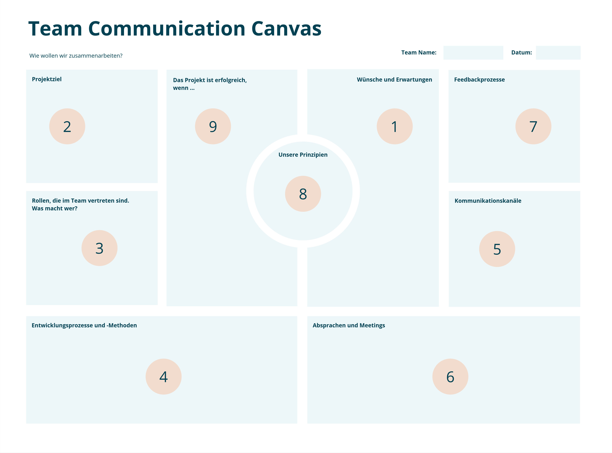
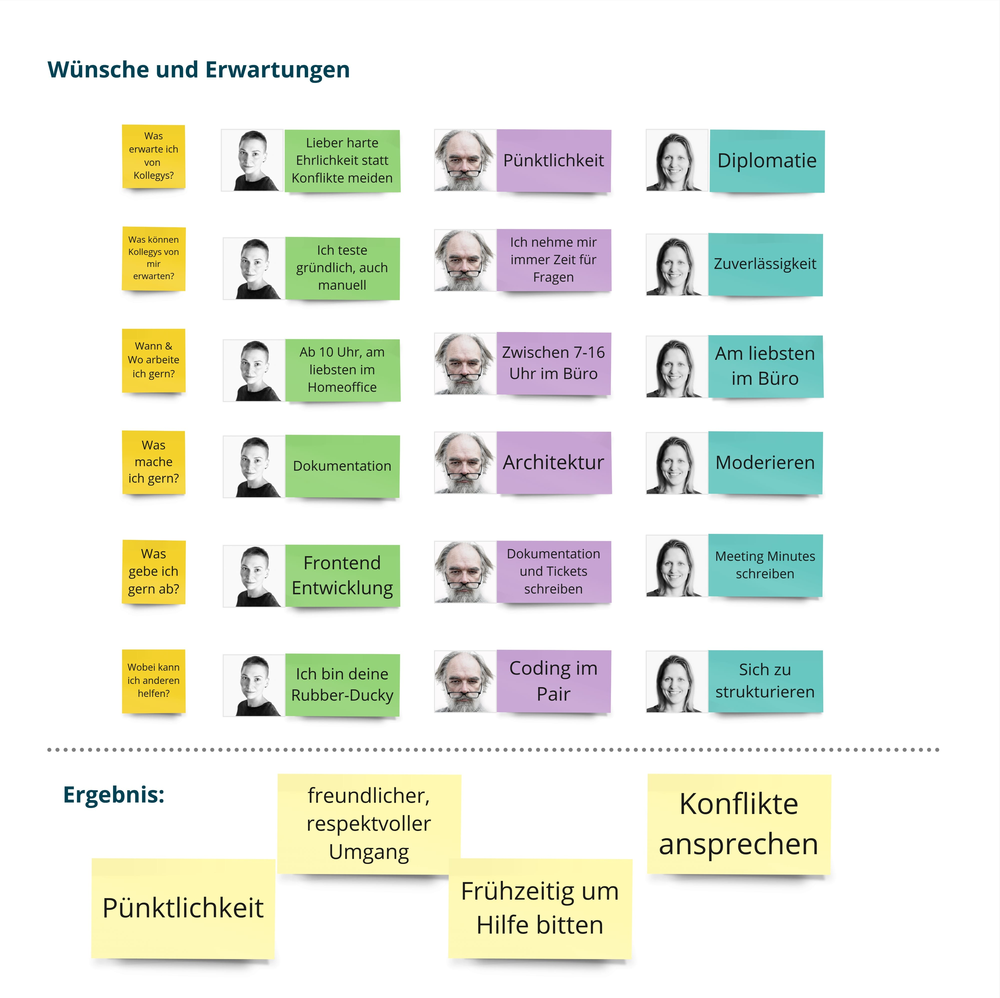
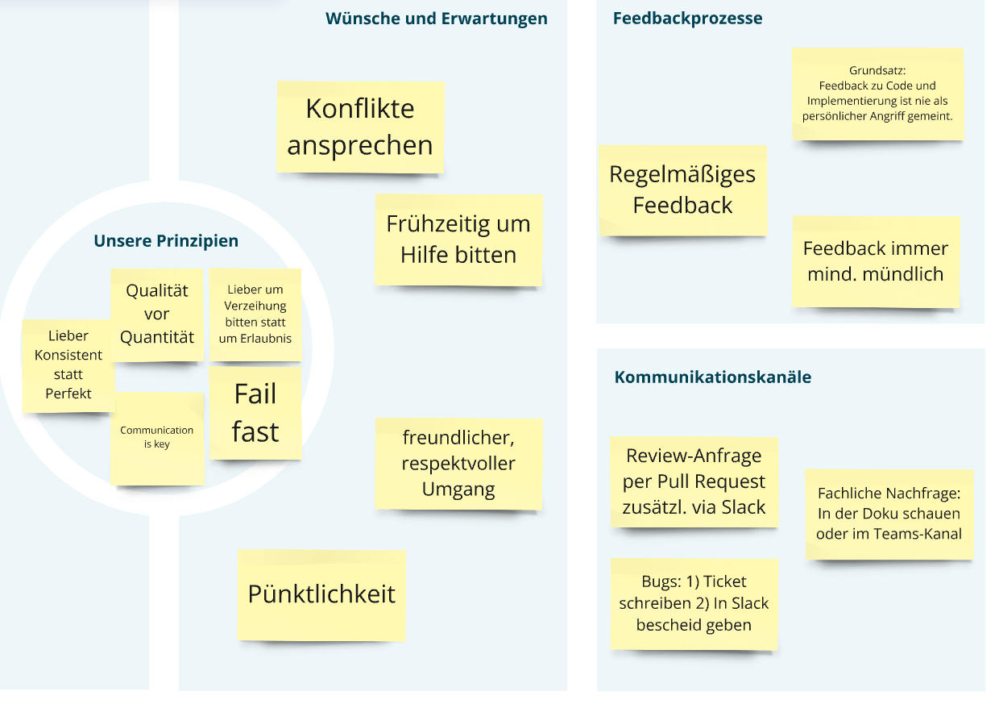
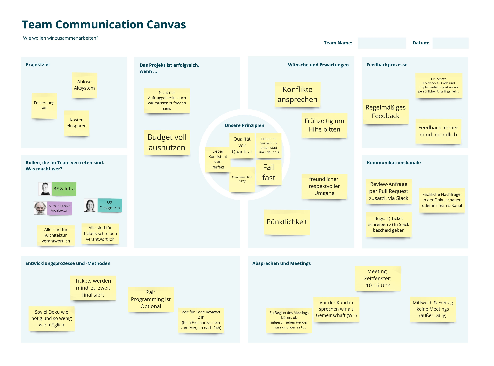

[#team-communication-canvas]
=== Team Communication Canvas

Von Anja Kammer und Lena Kraaz.

_Struktur für erfolgreiche Zusammenarbeit._

.Team Communication Canvas

[#tcc-motivation]
==== Motivation

Der Team Communication Canvas dient primär als Dokumentation eines gemeinsamen Workshop-Prozesses. Der eigentliche Mehrwert entsteht jedoch während des Workshops selbst: Durch den Austausch und die Reflexion der Teammitglieder werden Missverständnisse und Konfliktpotenziale frühzeitig sichtbar.

Um dies zu erreichen, lädt der Canvas zum gemeinsamen Gespräch ein. Er unterstützt dabei, Missverständnisse und Konflikte in der Zusammenarbeit zu vermeiden, indem er Teamarbeit und Kommunikation bewusst in den Fokus rückt. Ein häufiges Problem sind unklare oder unausgesprochene Erwartungen, die zu Spannungen führen können – etwa bei der Aufgabenpriorisierung, im Umgang mit Feedback oder bei unterschiedlichen Auffassungen von Höflichkeit. Oft wird fälschlicherweise angenommen, dass alle im Team dasselbe Verständnis von guter Zusammenarbeit haben. Der Canvas schafft hier Klarheit, indem er gezielt Fragen zu Erwartungen, Arbeitsweisen und Kommunikationsstilen stellt und so hilft, Konflikte frühzeitig zu erkennen und zu vermeiden.

Ein Beispiel: Wenn eine Person sich wünscht, dass am Vormittag alle Teammitglieder jederzeit erreichbar sind, während eine andere flexibel die eigene Zeit plant, sind Spannungen programmiert – es sei denn, man hat schon zu Beginn offen darüber gesprochen. Teams, die über ihre Erwartungen sprechen, können Missverständnisse früh identifizieren und gezielt gegensteuern. So entsteht ein konstruktiver Raum, in dem man Konflikte gar nicht erst eskalieren lässt, sondern sie als „abweichende Erwartungen" gemeinsam reflektiert.

Der Canvas macht Erwartungen und Arbeitsweisen transparent und bringt sie in eine Struktur. Teams erkennen so unklare Prozesse und können ihre Zusammenarbeit bewusst reflektieren. Das ist besonders wertvoll in dynamischen Projektteams, die sich häufig neu zusammensetzen, sodass sich die Konstellation der Beteiligten ändert. Gemeinsame Reflexion reduziert Missverständnisse, stärkt den Fokus auf gemeinsame Ziele und minimiert Konfliktpotenziale. Das Ergebnis: transparenter, respektvoller Austausch im Team, der langfristig die Produktivität und Zufriedenheit steigert.

[#tcc-zielgruppe]
==== Zielgruppe

Der Team Communication Canvas lädt das ganze Produkt- oder Projektteam dazu ein, kollaborativ zu erarbeiten, wie man die gemeinsame Zusammenarbeit gestalten möchte.

Der Canvas eignet sich für Teams, die gemeinsam in die Teamarbeit starten oder in denen sich die Zusammensetzung verändert – etwa, wenn neue Kolleg:innen hinzukommen. Entscheidend ist, dass alle festen Teammitglieder, die täglich operativ (egal ob in Präsenz, hybrid oder komplett remote) zusammenarbeiten, an dem Workshop teilnehmen.

Das sind in der Regel:

* UX Designer:innen
* Softwareentwickler:innen
* Softwarearchitekt:innen
* Tester:innen
* Product Owner:innen
* Projektmanager:innen
* Scrum Master/Agile Coach

[#tcc-inhalte]
==== Inhalte

Der Canvas umfasst 9 Abschnitte:

* *Wünsche und Erwartungen:* was sind die Wünsche und Erwartungen, die ich an meine Kolleg:innen habe?
* *Projektziel:* was ist das Ziel des Projekts (oder Abteilung oder des Produktes)?
* *Rollen:* welche Rollen und Tätigkeiten gibt es in unserem Team?
* *Entwicklungsprozesse und Methoden:* was möchten wir anwenden?
* *Kommunikationskanäle:* welche nutzen wir?
* *Absprachen und Meetings:* wann finden Meetings statt? Gibt es meetingfreie Zeiten?
* *Feedbackprozesse:* wie wollen wir uns untereinander Feedback geben?
* *Unsere Prinzipien:* welche Leitplanken/Entscheidungshilfen haben wir in unserem Team?
* *Das Projekt ist erfolgreich, wenn …:* welche Kriterien gibt es, damit es für das Team als erfolgreiches Projekt empfunden wird?

[#tcc-wuensche-erwartungen]
===== Wünsche und Erwartungen

Im Abschnitt „Wünsche und Erwartungen" des Team Communication Canvas werden persönliche Präferenzen, Arbeitsstile und Erwartungen der Teammitglieder ausgetauscht. Dabei steht nicht im Vordergrund, den Canvas auszufüllen. Es geht darum, sich gegenseitig im Arbeitskontext besser kennenzulernen und zu verstehen, ohne dass eine Einigung auf gemeinsame Regeln zwingend notwendig ist. Wenn sich das Team auf Inhalte einigt (Bsp: „Wir wollen Konflikte offen ansprechen.") sollte diese aber auf dem Canvas festgehalten werden.

Die Inhalte umfassen unter anderem bevorzugte Arbeitszeiten, Kommunikationsstile, Arbeitspräferenzen, Themenbereiche, in denen Unterstützung angeboten wird, und individuelle Werte wie Pünktlichkeit oder Etikette. Ziel dieses Abschnitts ist es, gegenseitiges Verständnis zu fördern und Missverständnisse im Alltag zu vermeiden.

[#tcc-projektziel]
===== Projektziel

Im Abschnitt „Projektziel" des Team Communication Canvas werden Ziele und Absichten dokumentiert, die das Team gemeinsam verfolgt. Der Begriff Projektziel ist hierbei austauschbar, da nicht immer ein „Projekt" im eigentlichen Sinne des Wortes der Kontext ist. Auch in Abteilungen, langfristigen Zusammenarbeitskontexten oder bei der Einführung neuer Prozesse ist es sinnvoll, über Ziele zu sprechen.

Hier können individuelle Perspektiven zu den übergeordneten Absichten festgehalten werden. Diese können konkret (z.B. Kosten einsparen oder Ablösung eines Altsystems) oder auch vage formuliert sein. Wenn kein gemeinsames Ziel erkennbar ist, ist das in diesem Schritt ebenfalls akzeptabel. In solchen Fällen kann es sinnvoll sein, die Klärung der Zielsetzung auszulagern, um den Rahmen des Meetings nicht zu sprengen.

[#tcc-rollen]
===== Rollen

Im Abschnitt „Rollen" des Team Communication Canvas werden die verschiedenen Tätigkeiten und Verantwortlichkeiten im Team dokumentiert. Dabei geht es nicht um formale Jobtitel, sondern um die tatsächlich ausgeübten Aufgaben. Rollen wie Infrastruktur-Expert:in, UX Designer:in oder Architekt:in beschreiben, welche Aufgaben und Schwerpunkte die einzelnen Teammitglieder übernehmen.

Ziel ist es, Klarheit darüber zu schaffen, wer welche Tätigkeiten übernimmt und wo es möglicherweise Überschneidungen oder Lücken gibt. Das heißt, es kann sichtbar gemacht werden, wo es gemeinsame Zuständigkeiten gibt (Beispiel: Tickets schreiben, Architekturarbeit).

[#tcc-entwicklungsprozesse-methoden]
===== Entwicklungsprozesse und Methoden

Im Abschnitt „Entwicklungsprozesse und Methoden" des Team Communication Canvas werden Arbeitsweisen, technische Praktiken und Teamregeln im Entwicklungsprozess dokumentiert. Es geht darum, individuelle Ansichten und Präferenzen zu Themen wie Dokumentation, Code Reviews, Fehlerkultur oder Pair-Programming zu besprechen.

Der Abschnitt ermöglicht es, unterschiedliche Erwartungen im Team offenzulegen – etwa, wie viel dokumentiert werden soll, ob Pair-Programming gewünscht ist oder wie Code Reviews zeitlich organisiert werden. Dabei werden sowohl persönliche Vorlieben als auch bestehende oder gewünschte Teampraktiken besprochen.

[#tcc-kommunikationskanaele]
===== Kommunikationskanäle

Im Abschnitt „Kommunikationskanäle" des Team Communication Canvas werden bevorzugte Wege und Tools zur Kommunikation für das Team dokumentiert. Dabei geht es um die Klärung, welche Kanäle für welche Art von Kommunikation genutzt werden sollen – beispielsweise Chat für schnelle Abstimmungen oder E-Mails für formellere Anfragen.

Ziel des Abschnitts in diesem Workshop ist, Transparenz über individuelle Vorlieben und bestehende Praktiken zu schaffen, etwa, ob jemand bevorzugt über Telefon kommuniziert oder wie Bugmeldungen dokumentiert werden sollten. Gleichzeitig werden mögliche Unklarheiten wie der Umgang mit mehreren Kommunikationskanälen angesprochen, um Überkommunikation oder das Verpassen relevanter Informationen zu vermeiden.

[#tcc-absprachen-meetings]
===== Absprachen und Meetings

Hier geht es darum, Transparenz über bevorzugte Meeting-Zeiten, -Formate und -Frequenzen zu schaffen, beispielsweise der Wunsch nach meetingfreien Tagen oder fokussierter Arbeitszeit ohne Unterbrechungen.

Hier können auch individuelle Vorlieben sichtbar werden, etwa ob jemand schriftliche Dailys bevorzugt oder Meetings erst ab einer bestimmten Uhrzeit sinnvoll erscheinen. Ziel ist es, Missverständnisse über die Verfügbarkeit und den Umgang mit Besprechungen zu vermeiden, ohne dass zwingend alle Präferenzen sofort vereinheitlicht werden müssen.

Die Diskussion im Team hilft, gemeinsame Richtlinien zu entwickeln, die sowohl den Bedarf an Abstimmung als auch den Wunsch nach ungestörter Arbeitszeit berücksichtigen.

[#tcc-feedbackprozesse]
===== Feedbackprozesse

Im Abschnitt „Feedbackprozesse" des Team Communication Canvas werden Erwartungen und Bedürfnisse rund um den Umgang mit Feedback im Team besprochen, wie z.B. der Wunsch nach regelmäßigem, direktem Feedback oder der Vorschlag eines festen Feedback-Tages.

Das Ziel ist es, eine gemeinsame Feedbackkultur zu fördern, indem besprochen wird, in welcher Form Feedback gegeben werden soll – ob mündlich, schriftlich oder in anderen Formaten. Auch grundlegende Prinzipien, wie der respektvolle Umgang mit kritischem Feedback, werden hier thematisiert.

Der Abschnitt schafft Klarheit darüber, was die Teammitglieder benötigen, um Feedback als konstruktiv und hilfreich wahrzunehmen, und kann so helfen, Missverständnisse zu vermeiden.

[#tcc-unsere-prinzipien]
===== Unsere Prinzipien

Der Abschnitt „Unsere Prinzipien" bündelt die Leitlinien, die für das Team besonders wichtig sind. Prinzipien sind kurze, prägnante Sätze, die wie eine Art Kompass wirken, wenn schnelle Entscheidungen getroffen werden müssen. Beispiele könnten sein „Kommuniziere lieber einmal zu viel als einmal zu wenig", „Lieber konsistent statt perfekt" oder „Qualität statt Quantität".

Eine Person, die unsicher ist, ob sie ein Problem sofort im Teamchat ansprechen soll, wird unweigerlich an das gemeinsame Prinzip „Kommuniziere lieber einmal zu viel als einmal zu wenig" denken und die Information zügig teilen.

Die letzten beiden Prinzipien – „Lieber konsistent statt perfekt" und „Qualität statt Quantität" – können dabei helfen, beim Programmieren, etwa bei Refactorings oder beim Schreiben von Tests, ein einheitliches Vorgehen zu finden, ohne für jeden Einzelfall eine Teamdiskussion führen zu müssen.

Ziel ist es, einen klaren Orientierungsrahmen zu schaffen, an dem sich alle im Team bei Unsicherheiten ausrichten können. Wichtig ist, dass es sich nicht um starre Regeln handelt, sondern um Grundsätze, die das tägliche Handeln leiten sollen.

[#tcc-projekt-erfolgreich]
===== Das Projekt ist erfolgreich, wenn …

Im Abschnitt „Das Projekt ist erfolgreich, wenn …" des Team Communication Canvas werden Kriterien dokumentiert, die den Erfolg aus Sicht des Teams definieren. Dabei geht es nicht nur um Projektziele, sondern um eine umfassendere Perspektive auf den gemeinsamen Erfolg. Die Frage kann auch allgemein verstanden werden als „Wann sind wir als Team erfolgreich?"

Neben messbaren Faktoren wie Kundenzufriedenheit, stabile Software oder Budgetausnutzung können hier auch individuelle oder teambezogene Aspekte thematisiert werden – etwa Lernfortschritte, Spaß an der Arbeit oder eine gute Zusammenarbeit auf Augenhöhe.

Dieser Abschnitt bietet Platz für verschiedene Sichten auf „Erfolg" und schafft Klarheit darüber, worauf das Team hinarbeitet. So können unterschiedliche Erwartungen besprochen und ein gemeinsames Verständnis für Erfolg entwickelt werden.

[#tcc-vorgehen]
==== Vorgehen

Das gemeinsame Bearbeiten des Canvas wird in einem Workshop-Format durchgeführt. Dabei ist es unerheblich, ob dieser Workshop vor-Ort oder in einem Remote-Setup durchgeführt wird. Wichtig ist lediglich genug Fläche um virtuelle oder reale Zettel kleben zu können und genug Freiraum für eine stille Einzelarbeit.

[#tcc-vorkenntnisse]
===== Vorkenntnisse

Es benötigt keine besonderen Vorkenntnisse. Wichtiger als Vorwissen ist die Bereitschaft, sich offen über eigene Bedürfnisse, Arbeitsweisen und Erwartungen auszutauschen. Daher hilft es, wenn das Team bereits ein grundlegendes Verständnis darüber hat, warum es überhaupt über Kommunikation und Zusammenarbeit reden sollte. Es sollte also vorher kurz erklärt werden, welchen Nutzen ein offener Dialog über Erwartungen haben kann.

[#tcc-reihenfolge]
===== Reihenfolge

Wir empfehlen eine bestimmte Reihenfolge, da Abschnitte aufeinander aufbauen. Gerade der Beginn mit den „Wünschen und Erwartungen" eröffnet eine persönliche Art der Kommunikation und des Verständnisses:

1. Wünsche und Erwartungen
2. Projektziel
3. Rollen
4. Entwicklungsprozesse und Methoden
5. Kommunikationskanäle
6. Absprachen und Meetings
7. Feedbackprozesse
8. Unsere Prinzipien
9. Das Projekt ist erfolgreich, wenn...

[#tcc-einzelarbeit]
===== Einzelarbeit

Jeder Abschnitt wird in der oben genannten Reihenfolge im Team zunächst in Einzelarbeit bearbeitet. Jede Person notiert ihre Sichtweisen auf den aktuellen Abschnitt (z. B. „Wünsche und Erwartungen").

.TCC Einzelarbeit

[#tcc-diskussion]
===== Diskussion

Das Team tauscht sich über Gemeinsamkeiten und Unterschiede zu jedem Abschnitt aus. Dabei ist es hilfreich, sich gegenseitig von Erfahrungen aus anderen Projekten zu berichten, um den eigenen Standpunkt verständlich zu machen.

Ziel ist es, Transparenz über die individuellen Sichtweisen zu schaffen und gemeinsam zu diskutieren, welche Methoden und Praktiken sinnvoll sind, um sie für das gesamte Team zu etablieren.

[#tcc-dokumentation]
===== Dokumentation

Die Absprachen, die in Zukunft für das ganze Team gelten sollen, werden in knappen Stichpunkten im Canvas notiert. Dabei braucht es keine zwingende oder vollständige Einigung. Unterschiedliche Standpunkte können deutlich werden und im Zweifelsfall auch später weiter diskutiert werden. Lücken sind erlaubt und schaffen Freiräume.

.TCC Dokumentation

[#tcc-empfehlungen]
==== Empfehlungen

Folgende Tipps helfen bei der Durchführung des Workshops:

* Schafft eine vertrauensvolle Atmosphäre: Alle sollen das Gefühl haben, frei über ihre Erwartungen und Bedürfnisse sprechen zu können.
* Seid offen für unterschiedliche Perspektiven und versucht, konstruktiv Kompromisse zu finden oder lasst bewusst Lücken, um Freiräume zu schaffen.
* Dokumentiert die Ergebnisse so, dass sie leicht für die Beteiligten auffindbar sind (z.B. einsehbar im Team-Wiki).
* Plant genug Zeit ein. Wir empfehlen 2-3 Stunden.
* Vereinbart, den Workshop zu wiederholen, sobald sich Teamkonstellationen ändern, und aktualisiert den Canvas entsprechend.
* Holt euch bei Bedarf eine „neutrale" Moderation dazu.

Folgende Stolpersteine können auftreten:

* *Zu hohe Erwartungen an „Endgültigkeit":* Der Canvas ist kein fixes Regelwerk für alle Ewigkeit. Er lebt davon, dass man ihn anpasst, wenn sich das Team weiterentwickelt.
* *Zu wenig Offenheit:* Wenn Teammitglieder sich nicht trauen, ihre echten Bedürfnisse auszusprechen, bleibt das Potenzial ungenutzt.
* *Erstellen und Vergessen:* Einfach nur „ausfüllen und abheften" reicht nicht. Macht euch die gemeinsamen Absprachen immer wieder im Alltag bewusst und integriert diese. In Retrospektiven können der Abgleich des Projektziels und das Erinnern an die Erfolgsfaktoren eine notwendige Kurskorrektur motivieren.
* *Bewertung durch Außenstehende:* Der Canvas gehört dem Team. Er ist nicht dazu gedacht, Teams von außen zu bewerten oder zu vergleichen.

[#tcc-beispiele]
==== Beispiele

.Team Communication Canvas Beispiel

Gerade in Beratungsteams, die immer wieder in neuen Konstellationen starten, hat sich dieses Vorgehen bewährt. Es wird ein neuer Canvas zu Projektbeginn ausgefüllt, sodass alle Beteiligten gleich zu Anfang wissen, wie sie miteinander umgehen wollen. Auch in langlaufenden Projekten kann ein Canvas-Workshop helfen, wenn sich die Teamzusammensetzung stark ändert oder neue Personen hinzukommen, die andere Perspektiven mitbringen. Der Canvas erleichtert es, Anregungen einzubringen, ohne dass sie im „blinden Fleck" der eingespielten Teamrituale untergehen.
