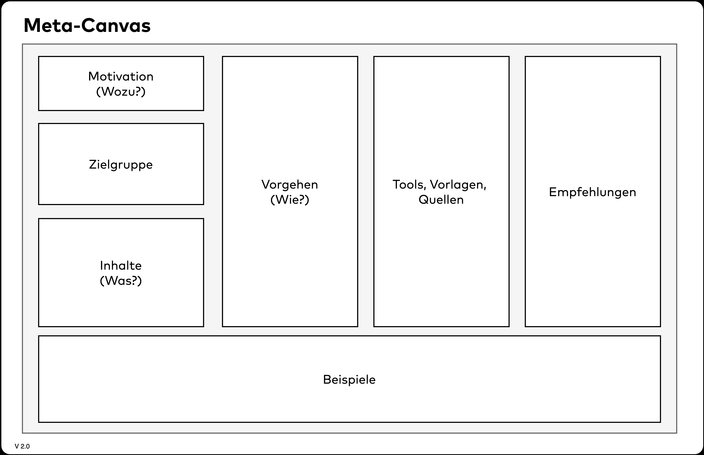

[#meta-canvas]
=== Meta-Canvas

Von Benjamin Wolf und Gernot Starke.

_We drink our own champagne._

.Meta-Canvas

Eigentlich ist dieser Canvas aus einem Scherz heraus entstanden. Als wir uns Gedanken machten, wie wir die einzelnen Canvases möglichst einheitlich beschreiben sollten, schlug Ben als Witz einen Canvas zur Beschreibung der Canvases vor. Gar nicht so abwegig, oder? Im Folgenden sind kurz die einzelnen Felder beschrieben, die Sie im Canvas oben sehen können. Vielleicht ist dieser Canvas auch für Sie nützlich, um Themen strukturiert zusammenzufassen – es muss ja nicht zwingend ein Canvas sein.

[#meta-motivation]
==== Motivation (Das Wozu)

Dieses Feld beschreibt relativ knapp, welchen Zweck der beschriebene Canvas erfüllt. Hier können Sie erklären, welchen Mehrwert er bietet, welche Probleme Sie damit genau lösen wollen, oder welche speziellen Fragestellungen Sie damit beantworten möchten.

[#meta-zielgruppe]
==== Zielgruppe

Ein wichtiger Aspekt bei jedem Canvas stellt – wie bei jeder Form von Dokumentation – die Zielgruppe dar, die Sie ansprechen möchten. Richtet sich Ihr Canvas an Fachbereiche, Product Owner oder das Management? Möchten Sie damit Strategieteams oder Softwareteams adressieren? Die Zielgruppe bestimmt, auf welchem Vorwissen, welcher Sprache und welchen Perspektiven der Canvas aufbauen kann.

[#meta-inhalte]
==== Inhalte (Das Was)

Mit einer der interessantesten Gesichtspunkte eines Canvas ist dessen Inhalt. Welche Bereiche, Themenfelder oder Dimensionen decken Sie mit dem Canvas ab? Beschreiben Sie hier die einzelnen Bausteine des Canvas und welche Informationen die jeweiligen Felder enthalten.

[#meta-vorgehen]
==== Vorgehen (Das Wie)

Hier beschreiben Sie, wie der Canvas am besten eingesetzt und befüllt werden soll. Stellen Sie sich die Fragen, ob Sie spezielle Methoden zur Erstellung des Canvas verwenden möchten, und ob der Canvas eher von einer Person alleine oder von einer Gruppe befüllt werden soll, z. B. in speziellen Workshop-Formaten.

[#meta-tools-vorlagen-quellen]
==== Tools, Vorlagen, Quellen

Bestimmt gibt es bereits eine Reihe von Vorlagen (druckbar oder digital), welche die Nutzung des Canvas unterstützen. Diese listen Sie hier auf und fügen Literaturhinweise, Websites oder andere Ressourcen hinzu.

[#meta-empfehlungen]
==== Empfehlungen

Wenn Sie bereits mit Ihrem Canvas gearbeitet haben, gibt es sicher einige positive wie negative Erfahrungen, die Sie dabei gemacht haben. Leiten Sie daraus Empfehlungen und Tipps zur Anwendung ab. Ebenfalls hilfreich sind Hinweise, wie die Ergebnisse im größeren Kontext funktionieren und mit welchen anderen Methoden oder Canvases sie zusammenhängen.

[#meta-beispiele]
==== Beispiele

Konkrete Anwendungsfälle oder Fallstudien zeigen den Mehrwert und erleichtern das Verständnis abstrakter Konzepte.
